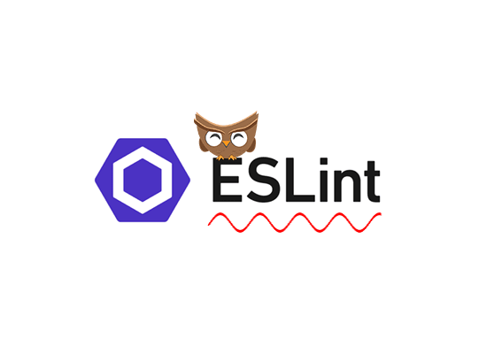

## Looking Back

Taking a software engineering course, may at first glance, appear to be mainly concerned with the technicalities of
 programing languages and designing usable software. Beyond that, there isn't much more a software engineering course
  can offer, right? Those were my initial thoughts when I took a software engineering class for the first time and
   looking back I was wrong with my prior assumptions. There are lessons to be learned regarding the benefits of
    following standard rules, benefits of using templates, and the importance of ethics that stretch beyond the realm of
     software engineering.
 
## Standards Are Not A Nightmare

In a software engineering course, there will probably be a mention of coding standards. These coding standards
 dictate the syntax and structure of the code and can be integrated into the software development environment. Some
  individuals, like myself, may see this as the nightmare equivalent of having an English teacher hover over your
   shoulder berating you for every grammar and spelling mistake. However, this isn't in place by some sadistic developer in an effort
    to stifle creativity. Instead, these standards (i.e. eslint) exists so that others can understand the code you have
     written
    . With a widely
     known standard, there is little guesswork and the intentions can be conveyed clearly. This can be taken beyond
      software engineering to giving situations such as giving a presentation. Using a widely known structure (i.e
       Title -> Introduction -> Main Point 1 -> Main Point 2... etc. for a PowerPoint presentation) allows others who
        didn't directly work with you
        to easily gain a understanding equivalent to your level. This is because structure helps ease the burden of
         taking in new knowledge.  

## Write Once But Use More Than Twice

You may have heard your teacher or your parents tell you the phrase "Don't be lazy!". I have heard this phrase many
 times and it was quite a surprise to hear the exact opposite when I took a software engineering class. Instead of
  creating all of the code entirely from scratch, there were templates to use for my own projects. At first glance
  , this may appear to have detracted from the learning experience. After all, isn't experiencing something from the
   ground up the best way to learn? Not necessarily, as using templates helped me save time that I could use on
    learning the concepts that were relevant to what I wanted to accomplish. It also allowed me to save even more
     time by performing minor edits and reusing the a majority of the same code. This work "smarter not harder
     " lesson extends beyond software engineering. For instance, simply creating a professional email template can
      save minutes or even hours when writing emails. It is important to look beyond the "lazy" stigma of such
       practices.

## Don't Let Ethics Be Overshadowed

There is nothing wrong with devoting most of one's time and energy to learning the coding languages and coding
 standards. However it is equally important to be aware of the ethics in software engineering. The most prominent
  case of this is Facebook and their mishandling of user data. There was nothing necessarily
   wrong with the software engineers as Facebook developing a well-designed and successful social media web
    application. The problem in this case was that the development of the software pushed ethics into the background
    . This resulted in grave breaches of user privacy and the use of their personal data for nefarious intents such
     as interfering with and election. These lessons can be extended beyond software engineering to both other
      careers and personal endeavours. Whatever goal you set for yourself, it is important to always take a step back
       and reflect if ethics has been discussed well enough.

## Conclusion

Overall, I have learned a multitude to technical lessons regarding to software engineering. However, to take those
 lessons at face value misses the chance to grow further from them. There are lessons to be learned about the
  benefits of standards, using templates, and upholding ethics if you look pass the computer code.
