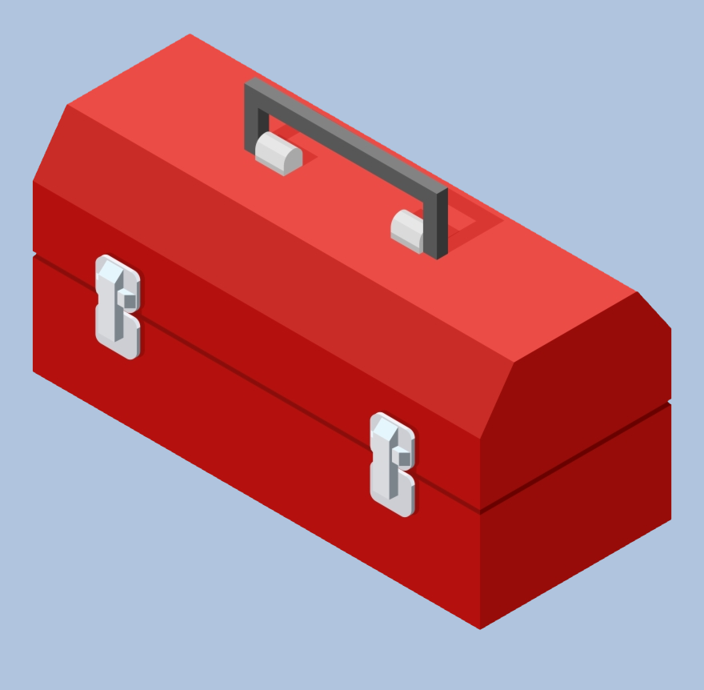

## Wait, I Have to What Now?!


Perhaps you've heard the phrase "If it ain’t broke, don't fix it." I was reminded of that particular phrase when I was tasked to learn how to use Semantic UI. This was somewhat annoying and intimidating as I just had gotten the hand of using HTML and CSS. A lot of time and effort went into developing my first websites with just HTML and CSS. However, since the website looked like I hopped into a time machine and went back to the 1990s, I knew that I had to pick up Semantic UI in order to start rolling out stylish 2019 standard sites.

## A UI Framework?



In a general, a UI framework is a software suite that allows a user to design a responsive and aesthetically pleasing website without the need of deep knowledge of technical and design skills. In a way, a UI framework is like a toolbox. Using the tools make completing the task easier and you don't need to know how to build a hammer or a screwdriver. In my case, Semantic UI is the toolbox that allowed me to ditch the 90s style webpage and dawn the 2019 modern style.

## An Example of Simplicity

The use of Semantic UI can make a day and night difference in designing a website. For example, let's say I was creating a website about the local bubble tea shop that opened up nearby. I took a picture of the delicious drink I ordered, and I want to place it on my website. Well, I could use purely HTML and CSS and define line by line the attributes of size, orientation, and so on. However, with Semantic UI, this all can be done with one line!

```html

```

With just the above line, I get an image that is centered on the page, large in size, and appears circular in shape. I saved time, energy, and another person reading my code can easily understand what I was trying to accomplish. It is basically a win-win all around to be using Semantic UI.

## Looking Towards the Future

While Semantic UI is a powerful toolbox, it unfortunately didn't come with brain plugin to instantly know how to use all the features. I still need time and practice to properly utilize Semantic UI to its full potential. Overall, I am very satisfied of the professional looking websites that Semantic UI has allowed me to make.
