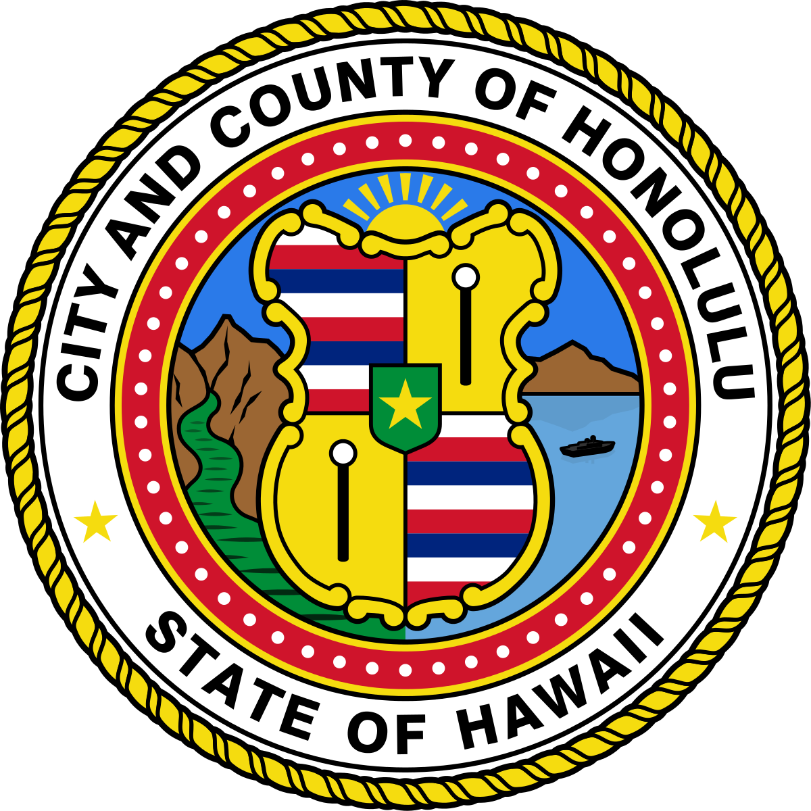

<div class="ui small rounded images">
  
  
  
</div>

## Building a Smarter City

Perhaps you've heard the jokes about how the government is slow, inefficient, and is just overall bad when it comes to completing projects. However, for the 14th Mayor of the City and County of Honolulu [Kirk Caldwell](https://www.kirkcaldwell.org/) wanted to change that. He envisioned the city of Honolulu evolving through the application of technology. I had the opportunity to help in this endeavor through the Pookela internship program.

## The City's Internship Program

The City and County of Honolulu's [Pookela Internship program](https://www.honolulu.gov/hr/pookela.html) places college students in various departments within the city government and pairs those students with mentors from that department. As part of the Pookela Class of 2019, I worked on several projects with the Department of Information Technology, Geographic Information Systems Division. I worked under the supervision of three mentors and had weekly progress report meetings to discuss my progress and any concerns I had. The final project I finished during my internship was a new conflict search service for the Lokahi application.

## Helping Build the Lokahi Application

Lokahi is an application developed at the City and County using ArcGIS. Produced by Esri, ArcGIS is a geographic information system software used to create maps, compile geographic data, analyze mapped information, sharing/discovering geographic information, and managing geographic information in a database. Esri also included a custom Python library (arcpy) with the software.

My new service was to create a Python service that automatically checked the project data from several agencies within the City and County of Honolulu and determine if proposed future projects conflicted with other present/future projects. For example, the Board of Water Supply planned a major water main replacement in front of Ala Moana shopping center on the first week of July next year. Also, at the same time, the Department of Transportation Services wanted to install new Bike Shelters in front of Ala Moana shopping center.

Using the functions within the arcpy library, the Python script would analyze for spatial (same location) and time conflicts and store that information into the geodatabase. It would then run through that data and send out emails to the supervisors of those projects to warn them that there is a potential conflict with another city project. This service would run daily at night so that the emails were present for the supervisors to check in the morning.

## Lessons Learned

From my time in the Pookela internship program, I gained a tremendous amount of experience regarding programming in a professional environment. Perhaps the greatest takeaway was the necessity of proper documentation. Since my conflict search function may require updating in the future, the next person reading my code needs to understand what I did and why. It felt very tedious at first, but with assistance from my mentors I was able tackle my bad habit of barebones documentation.

I am legally not allowed to provide the code as it is property of the City and County of Honolulu. The following is an example of how Python was used with [ArcGIS](https://pro.arcgis.com/en/pro-app/tool-reference/analysis/spatial-join.htm).

```python
# Import system modules
import arcpy
import os

# Set local variables
workspace = r"C:\gpqa\mytools\spatialjoin\usa.gdb"
outWorkspace = r"C:\gpqa\mytools\spatialjoin\output.gdb"

# Want to join USA cities to states and calculate the mean city population
# for each state
targetFeatures = os.path.join(workspace, "states")
joinFeatures = os.path.join(workspace, "cities")

# Output will be the target features, states, with a mean city population field (mcp)
outfc = os.path.join(outWorkspace, "states_mcp2")

# Create a new fieldmappings and add the two input feature classes.
fieldmappings = arcpy.FieldMappings()
fieldmappings.addTable(targetFeatures)
fieldmappings.addTable(joinFeatures)

# First get the POP1990 fieldmap. POP1990 is a field in the cities feature class.
# The output will have the states with the attributes of the cities. Setting the
# field's merge rule to mean will aggregate the values for all of the cities for
# each state into an average value. The field is also renamed to be more appropriate
# for the output.
pop1990FieldIndex = fieldmappings.findFieldMapIndex("POP1990")
fieldmap = fieldmappings.getFieldMap(pop1990FieldIndex)

# Get the output field's properties as a field object
field = fieldmap.outputField

# Rename the field and pass the updated field object back into the field map
field.name = "mean_city_pop"
field.aliasName = "mean_city_pop"
fieldmap.outputField = field

# Set the merge rule to mean and then replace the old fieldmap in the mappings object
# with the updated one
fieldmap.mergeRule = "mean"
fieldmappings.replaceFieldMap(pop1990FieldIndex, fieldmap)

# Delete fields that are no longer applicable, such as city CITY_NAME and CITY_FIPS
# as only the first value will be used by default
x = fieldmappings.findFieldMapIndex("CITY_NAME")
fieldmappings.removeFieldMap(x)
y = fieldmappings.findFieldMapIndex("CITY_FIPS")
fieldmappings.removeFieldMap(y)

#Run the Spatial Join tool, using the defaults for the join operation and join type
arcpy.SpatialJoin_analysis(targetFeatures, joinFeatures, outfc, "#", "#", fieldmappings)
```
