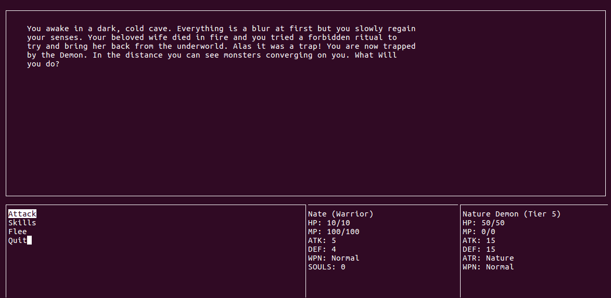

<p align="center">
  
</p>

## Building from a Childhood Passion

Soul Quest is a text-based dungeon crawler game inspired by the likes of Frontier and Oregon Trail. This was completed along with several other students for EE205, a course on object-oriented programing with C++. We used object-oriented programing to create the multitude of weapon types and monster types through the use of classes and inheritance. For example, the weapons lance, sword, and axe all inherited attributes (i.e. weapon attack level) from a base weapon class.


## The Story Told

The premise of the game is as follows: "Through unfortunate circumstances, your beloved wife died in a fire and wish to see her once again. In a desperate bid, you sell your soul to a demon for a chance of bringing your wife back from the underworld. Halfway through the ritual, you blackout and awake in the Demon's dungeon. It was a trick! Now you must make your way through the dungeon, confront the demon and reclaim your soul (and maybe your wife)."

The main feature of this game was the varity of enemies encountered and the multitude of ways you could fight them:

```md
### Weapon types
  1. Lance  
    *Strong against Sword but weak against Axe. (Warrior class only)*
  2. Sword  
    *Strong against Axe but weak against Lance. (Warrior class only)*
  3. Axe 
    *Strong against Lance but weak against Sword. (Warrior class only)*
  4. Staff
    *Neutral effectiveness (Mage class only)*

### Weapon rarity
  1. Bronze  
    *Lowest possible rating.*
  2. Silver 
    *Stronger than Bronze but weaker than Gold.*
  3. Gold  
    *Stronger than Silver but weaker than Platinum.*
  4. Platinum 
    *Stronger than Gold but weaker than Diamond.*
  5. Diamond
    *Stronger than Platinum but weaker than Legendary.*
  6. Legendary  
    *Highest possible rating.*

### Spells
  *Each class has three sets of spells for different weapon and element types
   and one default set for having no weapon.  Each set of spells has four different
   unique spells. Switching to a different weapon or element type will change your set
   of spells.*

### Enemy types
  *Stats {HP/ATK/DEF}*

### Beast (Tier 1) Takes full (normal dmg)  
  1. Wolves  
	*3 / 3 / 1*
  2. Cougars  
    *3 / 4 / 0*
  3. Bears 
	*3 / 2 / 2*

### Bandits (Tier 2)  
  1. Highway Bandit  
		*20 / 4 / 2*
  2. Rouge Knight - random triangle weapon  
		*30 / 3 / 5*
  3. Rogue Mage - Random element  
		*20 / 7 / 0*

### Skeleton (Tier 3)  
  1. Skeleton Warrior - random triange weapon  
		*40 / 7 / 7*
  2. Skeleton Mage - random element  
		*30 / 15 / 0*
  3. Skeleton Archer
    		*30 / 12 / 2*
  4. Arch Lich - random element 
		*50 / 8 / 5*

### Horrors (Tier 4)  
  1. Deformed beast - random element  
		*40 / 20 / 0*
  2. Deformed humans - random element and weapon  
		*60 / 10 / 10*
  3. Other worldly horrors - random element and weapon  
		*60 / 15 / 10*
  4. Horror gate guarded - random element and weapon  
		*100 / 10 / 15*

### Demon (Tier 5)
  1. Fire Demon - Fire element  
    *100 / 20 / 10*  
  2. Nature Demon - Nature element  
    *200 / 15 / 15*  
  3. Water Demon - Water element  
    *300 / 10 / 20*  

### The Demon (Tier 6)
  1. Satan (final boss) 
    *500 / 30 / 30*  

### Stages
  *Defeat enemies to collect their souls that will be used to move on further
  into the dungeon*

### Random Events
*Choose between two paths that will randomly decide your fate*
  1. Heal event
  2. Beggar event
  3. Loot events
  4. Resting event
  5. Trap event
  6. Enemy event

### Color HUD
  *Color helps distinguish important windows. For example, your stats appear
  in a blue window and the enemy stats appear in a red window*
```

## Dispose of Your Foe

For this project, I was responsible for creating and implimenting the weapons. I started 

Bellow is concept art I created for the game logo.


 
All source code and documentation can be found here: <a href="https://github.com/chriswon98/EE205/tree/master/Final/project"><i class="large github icon"></i>EE205</a>