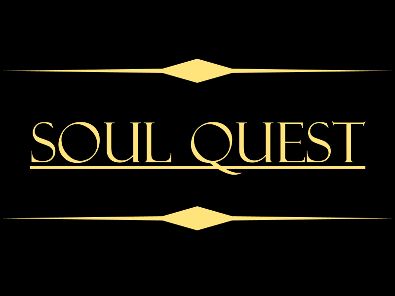

SoulQuest is a text-based dungeon crawler game inspired by the likes of Frontier and Oregon Trail. This was worked on by several other students and I created as the final project for our course on object oriented programing in C++.
 
Source: <a href="https://github.com/chriswon98/EE205/tree/master/Final/project"><i class="large github icon"></i>EE205</a>
