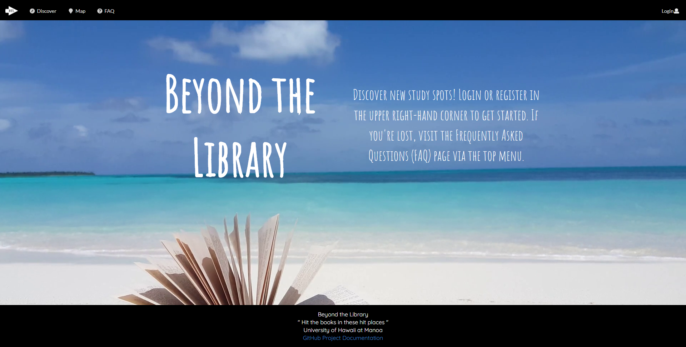
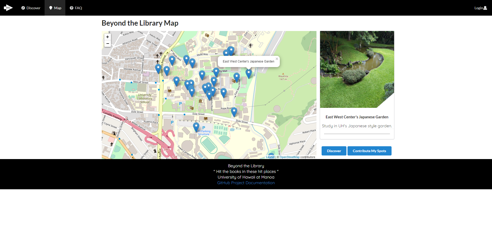

    

## Going "Beyond the Library"?

When it comes time to find a place to study, the first location that comes to mind is the
 library. While the library is a solid choice as a study location, it may be old, crowded, and rather plain
  environment to be cooped up in for hours on end. The problem here is that plenty of students are not aware of the
   multitude of other study locations that exist. Hence, working in a team of 4 students, we designed a web
    application to help UH students go "Beyond the Library" and discover as well as share study spots both on and off
     the UH Manoa campus.

    

    

## My Role

As part of the Beyond the Library team, I was responsible for creating the landing page, FAQ page, and handling the
 overall design choices of the site such as font style and color scheme. Getting the website to look aesthetically
  pleasing and keeping user navigation in mind was a challenge in of itself. I was also responsible for maintaining
   the github site that documented the features and development history of Beyond the Library. Additionally, I was
    responsible for maintaining the mongoDB database and publishing the site to Galaxy for each milestone of
     development.
     

    

         
## The Takeaway

Developing Beyond the Library was no easy feat and tested my web development skills as well as my ability to work in a
 team environment. The key new addition this time around was the use of Agile Project Management. By using Agile
  Project Management, my team and I were able to avoid the common deadlocks that arise in web development projects of
   this scale. The use of the lessons learned through Agile Project Management isn't only limited to web development
    and I plan on sharing this method in future group environments that I become a part of.

### Important Links

* [Beyond the Library GitHub Organization Page](https://github.com/beyond-the-library)
* [Beyond the Library Code Repository](https://github.com/beyond-the-library/beyond-the-library)
* [Beyond the Library Documentation Website](https://beyond-the-library.github.io/)
