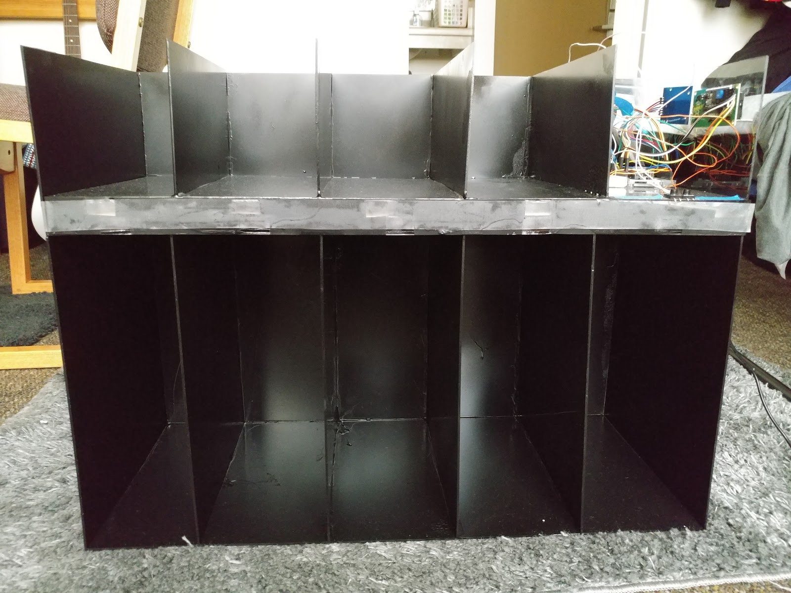

## A Student's Nightmare

Imagine you're a student and you just had a rough morning. You've overslept your alarm clock and barely made it on time to class. The teacher walks in and says, "Alright everyone, please take out your calculators for today's math exercise." As you reach into your bag, you freeze with shock as you realize that you had left your calculator in your room the night before. If only there was some other solution to be better organized?

## A "Smart" Solution

For my sophomore engineering project, my group and I attempted to solve that nightmare. The Smart Cubby is a custom-made cubby with an Arduino Uno microcontroller paired with a custom Android app also called "Smart Cubby". The Smart Cubby was constructed from plastic and had a total of 10 compartments, one of which housed the Arduino Uno microcontroller. The five larger slots were used for textbooks and the four smaller slots for other items (i.e. calculator). Each of the compartments had an LED light. These would turn on to indicate what items you needed for the school day. An RFID reader and kept track of what was in each compartment by scanning the RFID sticker tags on each item. The Android app allowed the user to input their schedule and related school supplies. This would then connect with the Arduino Uno via Bluetooth and tell which compartments to light up.

  

## Working in a Team

For this project, I was responsible for developing the Android application using [MIT App Inventor](https://appinventor.mit.edu/). This was done on the suggestion of our professor as I was relatively new to programming. MIT App Inventor was design by the Massachusetts Institute of Technology and simplified Android app design abstracting code into blocks. I used these code blocks to program the interface and communication with the Arduino microcontroller via Bluetooth. This taught me how to construct functions as well as the conventions of Android app design. I was also responsible for designing the graphic elements for the Android app, the PowerPoint presentation, and the logo for the final product.

## Lessons Learned

As my first major project, I learned two key lessons. One lesson is that communication is *key* to timely progress. The lack of proper communication between myself and the other students working on the hardware side resulted in major delays in testing. As a result, it took longer to sort out bugs between the Arduino microcontroller and the Android app. The week before submission was filled with dread and exhaustion as we struggled to complete a working product. This leads to the other key lesson of starting off simple before adding complexity. There was a handful of features that we wanted to incorporate like having multiple calendars. However, I was too focused on thinking of "what it could be" instead of getting a basic working version first. This left me paralyzed as I struggled to try and integrate all the features from the start. This experience continues to remind me to start off small and then start working on the complexity.
